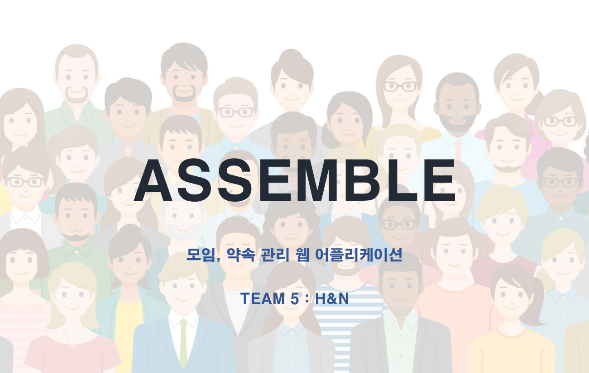
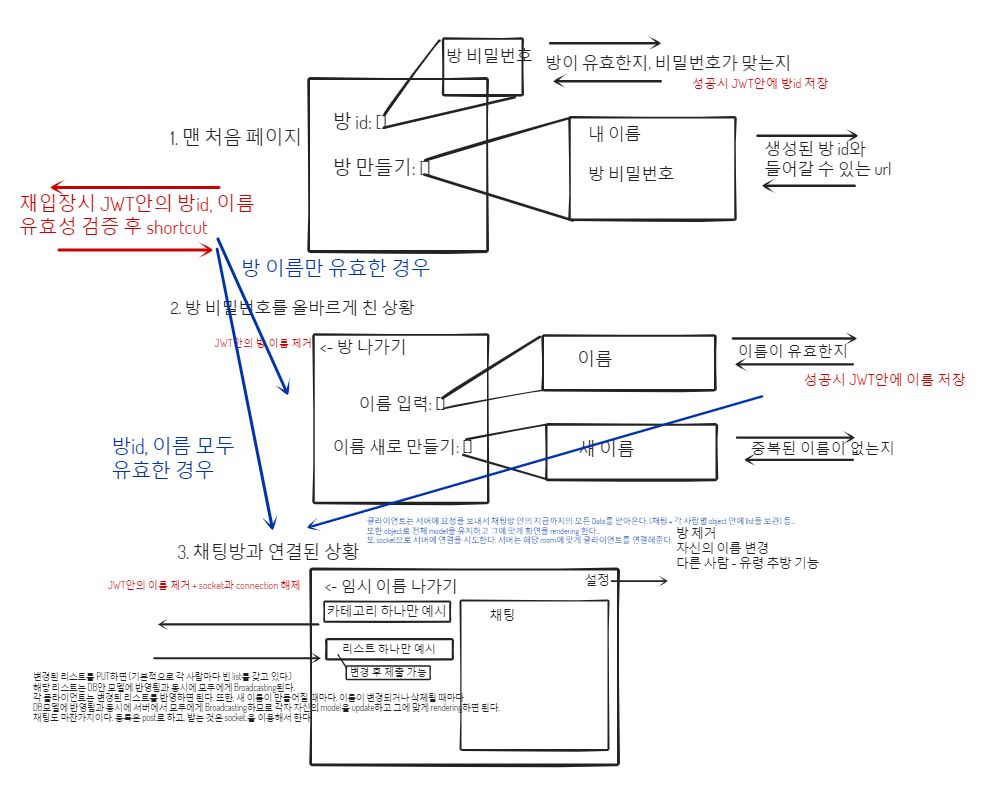

# **Assemble-client**

## **Team 5. H&N (Here And Now)**

## **Team Member**
- ### **윤성경** 
- ### **송성현**
- ### **노영민**

## **DEMONSTRATION | 시연 영상**

 

## **OVERALL DEMONSTATION**

## **1. 방 생성**

## **2. 방 입장**

## **3. 유저 생성**

## **4. 유저 입장**

## **5. 대시 보드**

## **6. 일정 탭 (항목 추가, 항목 변경, 변경내용 제출, 변경내용 취소)**

## **7. 장소 탭 (항목 추가, 항목 변경, 변경내용 제출, 변경내용 취소)**

## **8. 활동 탭 (항목 추가, 항목 변경, 변경내용 제출, 변경내용 취소)**

## **9. 메뉴 탭 (항목 추가, 항목 변경, 변경내용 제출, 변경내용 취소)**

## **10. 채팅**

## **일정과 진행상황 설명**

- #### **Backend**

#### 2020-01-14 ~ 2020-01-15 : server build와 basic structure 생성, API 초안 작성
#### 2020-01-16 : Socket.io를 이용한 기본적 서버 API와 기능 90% 이상 완성
#### 2020-01-20 : 버그 패치 + 모든 기능 완성
#### 2020-01-23 : 공식 프로젝트 일정 종료. 서버는 AMAZON EC2에, 클라이언트는 AMAZON S3 Bucket에 배포. 

- #### **Frontend**

#### 2020-01-14 ~ 2020-01-17 : 새로운 stack 공부 - Redux, Redux thunk, Ant design
#### 2020-01-14 ~ 2020-01-19 : 기본적인 클라이언트 구조 prototyping, 프로토타입 중에 메인 프로토타입 선택
#### 2020-01-20 ~ 2020-01-21 : Ant design 없이 Redux만으로 기능 90% 이상 완성
#### 2020-01-22 : Ant design 적용
#### 2020-01-23 : 공식 프로젝트 일정 종료. 서버는 AMAZON EC2에, 클라이언트는 AMAZON S3 Bucket에 배포. 

### **( 2020-01-23 기준 ) 접속 주소   http://assemble-client.s3-website-us-east-1.amazonaws.com/**

## **프로젝트 메인 컨셉과 기획, 구조 설명**

#### **초기 컨셉**  Assemble은 모임을 잡을 때 여러 사람들의 의견을 모아 결정하는 과정을 도와주는 간편한 Web App입니다.     참여자마다 각각 다른 여유 시간과 일정 정보들을 모아서 최대한 많은 사람들이 모일 수 있도록 최선의 모임 시간을 찾아냅니다.     또한 모임의 활동 내용과 식사 정보에 대한 참여자들 개인의 선호, 불호 여부를 결정에 반영해서 모두에게 만족스러운 의사 결정을 효율적으로 할 수 있도록 돕습니다.     참여자가 위치 정보를 지도 위에 표시해서 공유할 수 있는 기능을 제공해서 모두가 직관적으로 만날 장소를 고를 수 있게 해주고, 모임 장소까지 걸리는 시간을 파악하거나, 모임 장소와 가까운 맛집을 찾는 일을 도와줍니다.      또한 약속 날짜에 볼 수 있는 영화를 확인하고, 당일 날씨나 미세먼지 정보를 쉽게 찾아볼 수 있는 디테일한 기능에 더해서 실시간 채팅과 투표 기능을 통해서 빠르고 효과적인 의사 결정을 지원합니다.     마지막으로 모임이 끝난 이후, 비용을 정산하는 문제까지도 한번에 해결할 수 있도록 더치페이 계산기를 지원하고 있습니다.      모임에서 다같이 찍은 사진을 모두에게 공유하는 일도 사진 게시판을 이용하면 아무 문제 없습니다.     모임의 시작부터 끝까지 책임지는 Assemble은 현재는 외부 API에만 의존하고 있지만, 자체 서비스로 추천, 광고 방식의 수익 모델을 도입한다면 경쟁력 있는 Win Win 솔루션이 될 것입니다.    

### **High Level Object** : 모임, 약속시 일정, 장소, 활동, 메뉴 결정에 참여자의 각각 다른 의견을 모두 반영한 **직관적인 실시간 투표를 제공해서 효과적인 의사결정을 돕는 Web Application** 

### **프로젝트 기간 제한** : 2020-01-13 [ **프로젝트 시작** ] ~ 2020-01-23 [ **프로젝트 발표** ] 

### **예상 USE CASE**

#### < minimum requirement > DEVELOPMENT COMPLETE
- #### 1. 그룹 채팅방을 생성한다 *(방 생성시 방 이름과 비밀번호를 입력하면 방의 id를 받게 된다.)*  
- #### 2. 카카오톡 등의 메신저를 통해서 모임 참여자들에게 id와 비밀번호를 공유하면 각각 방에 들어와서*(참여자 등록은 안한 상태)* 방 참여자 이름을 등록하고 그룹 공간에 입장한다.
- #### 3. 한번 인증한 이후에는 다시 들어올 때 인증할 필요가 없다.
- #### 4. 그룹 채팅방에 제공되는 일정/장소/활동/메뉴 별 실시간 투표 기능으로 모두의 의견을 제출하고 *(각각의 의견에 좋아요, 싫어요 등을 누를 수 있고 새 의견을 제출할 수도 있다.)* 모든 메뉴의 진행 상황을 한눈에 볼 수 있는 대시보드로 전체 투표 현황을 직관적으로 확인할 수 있다. 또한 채팅방을 통해서 구체적인 의사소통이 가능하며, 채팅방은 항상 보면서 의사소통할 수 있다. *(화면 일부에 고정시킨다.)*

#### < challenging requirement > NOT DEVELOPED YET, BUT CHARMING
- #### 5. 일정은 캘린더나 시계를 보면서 가능한 시간들을 선택하고 투표 결과를 확인할 수 있다. 장소는 맵을 보면서 특정 지역을 선택하고, 투표 결과가 지도 위에 보이므로 직관적이다.(upgrade UI)
- #### 6. 다양한 주제와 방식의 Custom 투표를 생성하고 사용할 수 있다. 
- #### 7. 온라인인 사람 표시하기 - 어렵지는 않지만 중복 로그인 관련 issue 등 여러가지 구현 방식이 있을 수 있다.
- #### 8. 선택한 위치(+시간) 기준으로 출발지부터 도착지까지 경로 + 예상시간 을 볼 수 있다. (외부 API 연결) 
- #### 9. 선택한 위치(+시간) 기준으로 주변 맛집 탐색, 추천 기능을 쓸 수 있다. (외부 API 연결)
- #### 10. 선택한 시간(+위치) 기준으로 날씨, 미세먼지 정보, 상영 영화 등의 정보를 볼 수 있다. (외부 API 연결)
- #### 11. 사진 게시판에 모임 당일 찍은 사진을 공유할 수 있다.
- #### 12. 모임 당일의 정산 정보를 관리할 수 있고, 더치페이 계산기를 통해서 각각 내야 할 돈을 바로 볼 수 있다.
- #### 13. 스마트폰 Application으로 사용할 수 있다.
- #### 14. 카카오톡 초대기능 등으로 더 간편하게 사용할 수 있다. 
- #### 15. 카카오페이 더치페이 기능등을 연동해서 이용할 수 있다.
- #### 16. 모임 내에서 인기있었던 맛집, 메뉴, 영화, 장소, 키워드 등을 실시간 급상승 목록으로 보여주고, 추천 서비스도 제공해준다. (수익모델 - 실제 의사결정 상황에서 사용자들과 밀접하게 상호작용하며 편의를 제공하기 때문에 이벤트 홍보 등에 효과적이다.)

### **Tech Stack** :    [ **Server Side** ]에는 짧은 기한에 맞게 **안정적이고 빠른 개발**을 위해서 이미 **익숙하고 디버깅, 이슈 해결에 자신이 있는** **Node.js**와 **express**를 이용해서 서버를 구성했고,   개발 초기에 자주 생길 수 있는 **변경사항에 빠르게 대응하고 실시간 처리에 맞는 성능을 보장**하기 위해서 **자유로운 형식을 지원하며 대용량 데이터 처리에 적합**한 NoSQL 타입의 데이터베이스인 **Firebase - FireStore**를 사용했습니다.   **실시간 웹 서비스**를 위해서 **Socket.io**를 사용했습니다.    [ **Client Side** ]에는 **클라이언트의 복잡한 상태와 구조를 효율적이고 간단하게 처리**하기 위해서 **상태 처리를 한 장소에서 단방향으로 진행하게 도와주는 Redux**와   **안정적이고 빠른 개발**을 위해 이미 **익숙하고 디버깅, 이슈 해결에 자신이 있으며 효율적인 클라이언트 처리를 통해 반응성이 높은 React**를 이용해서 클라이언트 구조를 잡았고,    **빠르고 쉽게 사용자가 만족할만한 퀄리티의 UI를 제공**하기 위해 **Ant Design**을 사용해서 디자인을 구성했습니다.    **실시간 웹 서비스**를 위해서 **Socket.io**를 사용했습니다. 

## **실시간 소통을 위한 구조 선택 issue와 각 구조에 대한 장/단점**
### **상황**: 각 참여자가 [일정, 장소, 활동, 메뉴] 에 대한 투표목록을 갖는다. 채팅은 따로 방에 속한 것으로 한다. *(간단한 채팅 기능으로 충분하므로 참여자에 종속시키지 않고 방에 전체 채팅 목록을 종속시킨다.)*   클라이언트는 실시간으로 모든 사람의 총 투표 결과를 확인할 수 있다. ex: "월요일 3시"에 몇명이 괜찮다고 했는지, "볼링 치기"에 몇 개의 좋아요와 싫어요가 있는지 실시간으로 확인
### 기본적으로 새로운 **입력 요청은 형식에 맞게 보내기 위해 일반 REST API로 보낸 후, 변경 사항은 실시간성을 위해서 해당 방의 참여자들에게 Socket.io로 전달**된다. 
## **구조 1. 서버에서 방마다 모델(총 투표 정보) 유지 + 변경내용 발생 시 유지하고 있던 모델 기반으로 변경된 내용 클라이언트에 전달**
- ### 클라이언트는 **맨 처음 들어올 때 자신의 방의 뷰를 서버에서 가져와서 렌더링**한다.  서버는 실시간으로 **모든 방의 상태를 방 별로 서버 안 모델에 저장해서 유지**하고, 클라이언트와 실시간으로 상호작용하면서 **직전 모델에서 변경사항을 해당 방의 클라이언트들에게 전달**해준다.   **<장점>**: 클라이언트는 **서버에 자신의 입력만을 전달**하고, 서버에서 **변경사항이 들어오면 그대로 변경해서 렌더링**하면 되기 때문에 **클라이언트 구현이 쉽다.**   **사용자가 적고, 방의 수가 적은 상황이 보장되고 활발한 방들만 있다는 전제 하에** 클라이언트와 서버 모두 **구현하기 쉽고, 통신 양이 적어서 가장 효율적**이다.   **<단점>**: **방의 개수가 많고, 활발하지 않은 방의 비율이 높은 경우**, 서버 안에 모든 방의 정보를 항상 저장해야 하기 때문에 **비효율적이고 서버의 부담이 커져서 Scalable하지 않다.**   **따라서 많은 방을 지원해야 하고, 항상 활발한 방의 비율이 높지 않은 ASSEMBLE에는 적절하지 않은 구조**이다.
## **구조2. 서버에서 변경사항 발생시마다 DB에서 모델을 계산해서 변경된 내용 클라이언트에 전달**
- ### 클라이언트는 **맨 처음 들어올 때 자신의 방의 모델을 서버에서 가져와서 렌더링**한다.  **모든 방의 상태는 방 별로 데이터베이스 안의 모델에 저장**해놓고, 클라이언트가  요청을 보내면, **요청을 받았을 때만 데이터베이스 안에 있는 해당 방의 모델을 수정하고 변경사항을 해당 방의 클라이언트들에게 전달**해준다.   **<장점>**: 클라이언트는 **서버에 자신의 입력만을 전달**하고, 서버에서 **변경사항이 들어오면 그대로 변경해서 렌더링**하면 되기 때문에 **클라이언트 구현이 쉽다.**   **방의 개수가 많고, 활발하지 않은 방의 비율이 높은 경우**, 방이 아무리 많더라도 **모든 방의 상태를 서버가 유지할 필요가 없어서 부담이 적고 확장성이 높아진다.**   **<단점>**: **일시적으로 트래픽이 높아지는 상황에서 매번 클라이언트가 입력을 요청할 때마다 변경사항을 찾기 위해서 테이블을 조인해서 부분적으로 모델을 완성 하는 과정을 반복해야 하므로 비효율적이다.**   **따라서 항상 요청이 균일하게 주기적으로 오는 것이 아니라, 참여자들이 모임을 갖는 순간에 폭발적으로 증가하는 ASSEMBLE에는 최적의 구조는 아니다.**
## **구조3. 클라이언트에서 모델 유지, 서버에서는 변경사항을 추가 처리 없이 클라이언트에 전달 후 클라이언트에서 새로운 모델 계산**
- ### 클라이언트는 **맨 처음 들어올 때 자신의 방의 모델을 서버에서 가져와서 렌더링**한다.  **자신이 속한 방의 상태를 클라이언트가 최신 모델로 유지**하며, 입력이 생기면 클라이언트가 자신의 입력을 서버에 제출한다.   입력을 받은 서버는 해당 참여자의 **입력(새 투표 목록)을 데이터베이스에 덮어쓰기**만 하며 **입력 내용을 그대로 해당 방의 다른 클라이언트에게 전달**한다.   클라이언트는 **변경사항을 받을 때마다 자신이 유지하는 모델을 업데이트하며 새 모델을 렌더링한다**.   **<장점>**: **방이  많아지더라도, 방이 순간적으로 활발하게 운영되더라도 서버와 데이터베이스에 미치는 부담이 최소화된다**. *(또한 데이터베이스에 매 입력마다 쓰는 작업이 부담스러울 정도로 입력 수가 많고 주기가 짧을 경우 모델의 Reliability를 희생하면서 입력을 버퍼링 시켜서 데이터베이스에 제출하면 효율적으로 대규모 입력을 처리할 수 있다.)*   **<단점>**: 클라이언트가 모델을 유지하고 관리해야 하는 책임이 생기기 때문에 **클라이언트 구현이 어려워지고, 모든 클라이언트가 동일한 작업을 한다는 비효율성이 생긴다.** *(클라이언트가 다뤄야 할 모델이 크고 복잡하다는 상황에서는 이런 비효율성이 문제가 될 수 있다. 하지만 같은 그룹끼리 같은 처리를 한다는 점을 이용해서 같은 그룹끼리 묶어서 분산처리를 한다면 이 문제도 충분히 해결할 수 있다.)*   **따라서 클라이언트 구현이 어려워지긴 하지만, ASSEMBLE의 사용 환경에 최적의 구조인 구조 3을 사용하게 되었다.** 
### **COMMENT - 프로젝트 USE CASE에 최적인 3번 구조를 선택했고, 이 구조에는 클라이언트 구현 난이도가 높은 단점이 있다.   서버를 빠르게 완성하고 남은 시간을 클라이언트 구현에 사용하면 충분할 것이라고 설계 당시 예상했지만, 클라이언트에 새로 도입한 기술 이해와 함께 모델 관리를 10일이라는 시간 정도에 여유롭게 구현하기에는 구현 난이도가 높은 편이었다. 이 결정 때문에 모두 고생했고, 10일 제한의 프로젝트를 진행하는 프로젝트 관리 측면에서는 1번이나 2번 구조를 선택하는 것이 더 나은 선택이었을 것 같다.** 

 

# **API Overview**
### **API 생성에 참고한 API Overview 초안이다.**

 

# **Frontend Structure**

## **Home - page**

##### 설명 : 맨 처음 유저가 접속했을 때 보이는 페이지다. **방 생성과 방 입장 기능을 제공**한다.   이전에 접속했던 기록이 있다면 해당 단계까지 바로 넘어가는 shortcutFromMemory : action을 지원한다.

- #### **JoinRoom - function component** 
##### 설명 : Modal-Button으로 버튼을 누를 시, 방 입장 form이 나타난다. 방id와 비밀번호를 제출시 validation 후 서버에 방 입장 요청을 보낸다.  ( 방 입장이 성공하면 Room - page로 넘어간다. )

- #### **CreateRoom - function component** 
##### 설명 : Modal-Button으로 버튼을 누를 시, 방 입장 form이 나타난다. 방 이름와 비밀번호를 제출시 validation 후 서버에 방 생성 요청을 보낸다.  ( 방이 생성되면 생성된 방 id를 알려준다. )

## **Room - page**

##### 설명 : 유저가 방 입장에 성공했을 때 보이는 페이지다. 방 안에서 **유저 생성, 유저 입장과 방 나가기 기능을 제공**한다.   이전에 접속했던 기록이 있다면 해당 단계까지 바로 넘어가는 shortcutFromMemory : action을 지원한다. 

- #### **JoinUser - function component** 
##### 설명 : Modal-Button으로 버튼을 누를 시, 유저 입장 form이 나타난다. 유저 이름을 제출시 validation 후 서버에 유저 입장 요청을 보낸다.   ( 유저 입장이 성공하면 Group - page로 넘어간다. )

- #### **CreateUser - function component** 
##### 설명 : Modal-Button으로 버튼을 누를 시, 유저 생성 form이 나타난다. 유저 이름을 제출시 validation 후 서버에 유저 생성 요청을 보낸다.   ( 유저가 생성되면 생성된 유저 이름을 알려준다. )

- #### **OffRoom - function component** 
##### 설명 : 버튼을 누를 시, 기억해둔 방 접속 정보를 삭제하고 Room - page에서 나와서 Home - page로 가게 된다.

## **Group - page**

##### 설명 : Room - page에서 유저가 유저 입장에 성공했을 때 보이는 페이지다. **유저 나가기 기능, 투표 현황을 볼 수 있는 Dashboard 기능, <일정> <장소> <활동> <메뉴> 투표 기능과 채팅 기능을 실시간으로 제공**한다.   새로고침 시에도 접속한 상태가 유지되게 도와주는 keepConnectionInRefresh를 지원한다.

- #### **OffUser - function component** 
##### 설명 : 버튼을 누를 시, 기억해둔 유저 접속 정보를 삭제하고 Group - page에서 나와서 Room - page로 가게 된다.

- #### **DashboardTab - complex container**  
##### 설명 : 실시간으로 업데이트되는 <일정> <장소> <활동> <메뉴> 투표 현황을 top 5로 한눈에 볼 수 있다. 

- - #### **ScheduleList (summary mode) - function container**   설명: 일정 투표 현황 top5를 보여준다. 자신의 투표를 구분해준다.
- - - #### **ScheduleRow - component   설명: 일정 투표의 각 항목을 표현한다. 자신의 투표는 강조해서 표현한다.(페이스북 참고)**

- - #### **PlaceList (summary mode) - function container**   설명: 장소 투표 현황 top5를 보여준다. 자신의 투표를 구분해준다.
- - - #### **PlaceRow - component   설명: 장소 투표의 각 항목을 표현한다. 자신의 투표는 강조해서 표현한다.(페이스북 참고)**

- - #### **ActivityList (summary mode) - function container**   설명: 활동 투표 현황 top5를 보여준다. 자신의 투표를 구분해준다.
- - - #### **ActivityRow - component   설명: 활동 투표의 각 항목을 표현한다. 자신의 투표는 강조해서 표현한다.(페이스북 참고)**

- - #### **MenuList (summary mode) - function container**   설명: 메뉴 투표 현황 top5를 보여준다. 자신의 투표를 구분해준다.
- - - #### **MenuRow - component   설명: 메뉴 투표의 각 항목을 표현한다. 자신의 투표는 강조해서 표현한다.(페이스북 참고)**

- #### **ScheduleTab - function container**  
##### 설명 : 실시간으로 업데이트되는 <일정> 투표를 보면서 **새 항목 생성, 기존 투표 변경, 변경 내용 취소, 변경 내용 제출 기능**을 제공한다.   자신의 변경 내용은 실시간 투표상황 변화에도 유지된다.

- - #### **ScheduleList - function container**   설명: 일정 투표 현황을 보여준다. 자신의 투표를 구분해준다. 자신의 변경내용 유지의 핵심 로직을 담당하고 있다.
- - - #### **ScheduleRow - component   설명: 일정 투표의 각 항목을 표현한다. 자신의 투표는 강조해서 표현한다.(페이스북 참고)**

- #### **PlaceTab - function container**  
##### 설명 : 실시간으로 업데이트되는 <장소> 투표를 보면서 **새 항목 생성, 기존 투표 변경, 변경 내용 취소, 변경 내용 제출 기능**을 제공한다.   자신의 변경 내용은 실시간 투표상황 변화에도 유지된다.

- - #### **PlaceList - function container**   설명: 장소 투표 현황을 보여준다. 자신의 투표를 구분해준다. 자신의 변경내용 유지의 핵심 로직을 담당하고 있다.
- - - #### **PlaceRow - component   설명: 장소 투표의 각 항목을 표현한다. 자신의 투표는 강조해서 표현한다.(페이스북 참고)**

- #### **ActivityTab - function container**  
##### 설명 : 실시간으로 업데이트되는 <활동> 투표를 보면서 **새 항목 생성, 기존 투표 변경, 변경 내용 취소, 변경 내용 제출 기능**을 제공한다.   자신의 변경 내용은 실시간 투표상황 변화에도 유지된다.

- - #### **ActivityList - function container**   설명: 활동 투표 현황을 보여준다. 자신의 투표를 구분해준다. 자신의 변경내용 유지의 핵심 로직을 담당하고 있다.
- - - #### **ActivityRow - component   설명: 활동 투표의 각 항목을 표현한다. 자신의 투표는 강조해서 표현한다.(페이스북 참고)**

- #### **MenuTab - function container**  
##### 설명 : 실시간으로 업데이트되는 <메뉴> 투표를 보면서 **새 항목 생성, 기존 투표 변경, 변경 내용 취소, 변경 내용 제출 기능**을 제공한다.   자신의 변경 내용은 실시간 투표상황 변화에도 유지된다.

- - #### **MenuList - function container**   설명: 메뉴 투표 현황을 보여준다. 자신의 투표를 구분해준다. 자신의 변경내용 유지의 핵심 로직을 담당하고 있다.
- - - #### **MenuRow - component   설명: 메뉴 투표의 각 항목을 표현한다. 자신의 투표는 강조해서 표현한다.(페이스북 참고)**

- #### **Chats - function container**  
##### 설명 : 실시간으로 업데이트되는 채팅을 보면서 **새로운 채팅 전송 기능**을 제공한다.

- - #### **ChatList - function container**   설명: 전체 채팅을 보여준다.(최근것을 아래에 표시) 자신의 채팅을 구분해준다. 변경사항이 생길때마다 최근 올라온 채팅이 보이는 위치로 스크롤을 내려준다.
- - - #### **ChatRow - component   설명: 각 채팅의 말풍선을 표현한다. 자신의 투표는 오른쪽에 강조해서 표현한다.(카카오톡 참고)**

- - #### **SubmitChat - function component**   설명: **새로운 채팅 제출 기능**을 제공한다.

 

# dev log
- ### **2020-01-14: 테스트 프레임워크인 mocha를 이용해서 비동기 요청을 테스트 하는 방법을 직접 해보면서 배웠다.**
- ### **2020-01-15: API를 user scenario를 통해 직접 만들어보면서 문서의 중요성과 생각보다 할 일이 많음을 느꼈다. 또 JWT를 이용해서 로그인 기능을 비롯한 상태 관리를 해봤다.**
- ### **2020-01-16: Socket.io를 사용하면서 실시간으로 연결된 client들에게 공지하는 것, 방 별로 나눠서 client를 보내는 것, 연결할 때와 연결을 끊을 때의 고려 사항, REST API를 받아서 socket으로 보내는 코딩 패턴 등에 대해 직접 해보면서 생각해봤다.**
- ### **2020-01-17~18: Redux, Redux-thunk와 Axios를 통해서 서버와의 연결, 전체 기능 구현과 구조에 초점을 둔 Pilot Project를 진행했다. 이것을 기반으로 실제 클라이언트에 기능들을 구현하는데 사용할 것이다. 백엔드 관점에서만 바라보다 프론트엔드 관점에서 새로 프로젝트를 바라보게 되니 소통과 전체 프로젝트 관리에 도움이 되는 것 같다.**
- ### **2020-01-20: redux에서 받아온 action을 그대로 쓰지 말고, connect를 통해 props로 전달된 연결된action을 써야 한다. 잘 보이지 않으므로 조심하자.**
- ### **2020-01-21: ant design을 적용할 때에는 신중하게 결정하자. 자잘한 input을 쉽게 대체할 수 있지만, 메인 로직을 ant design의 코드가 복잡하게 만들어 코드를 읽기 어렵게 만들 수 있으므로 컴포넌트화와 명시적 메소드 정의가 필요하다.**
- ### **2020-01-22: socket과 asynchronous event를 이용한 실시간 구현을 할 때에는 event Listener 가 같은 메시지에 중복으로 반응하는 double message issue가 발생할 수 있다. 이를 해결하기 위해서 나는 socket으로 보내지는 payload에 고유 id를 주고, 최신의 payload id를 기억해서 같은 id인 경우에는 무시하는 방식으로 이 문제를 극복했다.**
- ### **2020-01-23: 배포를 프로젝트 발표 당일날 처음 해서 테스트 시간이 부족했다. 다행히 많은 issue가 발생하진 않았지만, 배포환경에서 테스트시 이전에 생각하지 못했던 일들이 발생할 수 있으므로 미리미리 하는 게 중요한 것 같다.**

## **good references helped us for developing this project**
- **[socket.io tutorial](https://socket.io/get-started/chat/)**
- **[chatting application using socket.io](https://poiemaweb.com/nodejs-socketio)**
- **[Socket IO with Parameters in React](https://medium.com/@liz.m.zheng/socket-io-with-parameters-in-react-59423d16eb52)**
- **[How to scroll to bottom in react?](https://stackoverflow.com/questions/37620694/how-to-scroll-to-bottom-in-react)**
